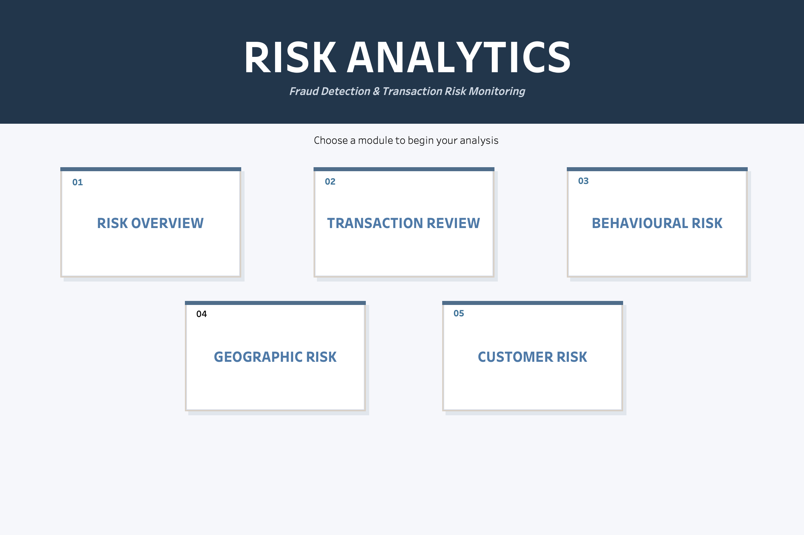
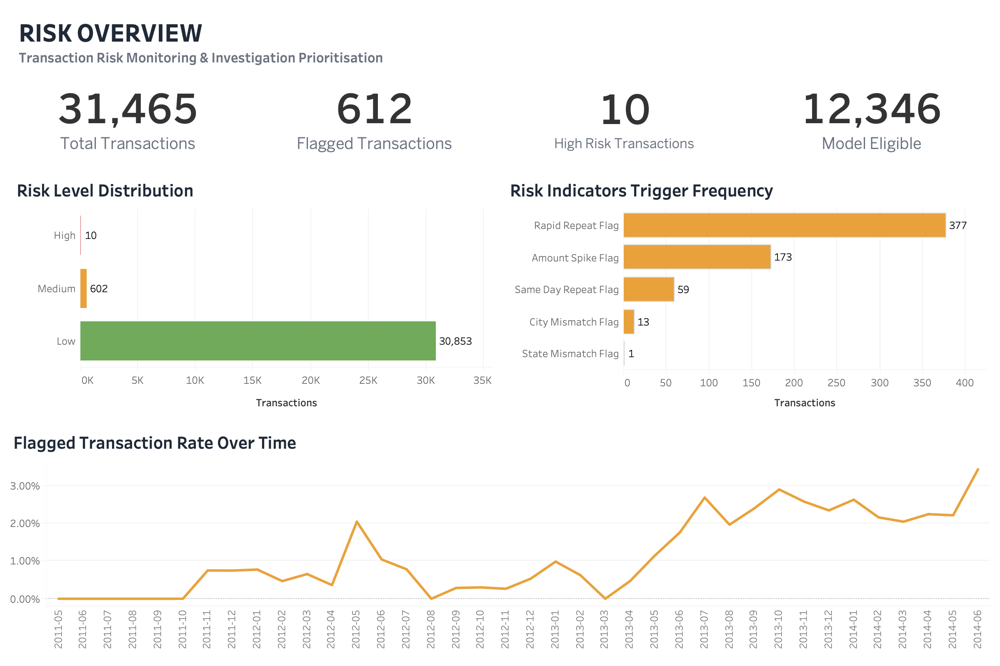
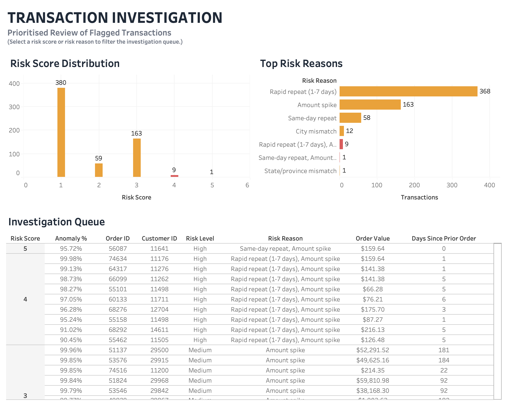
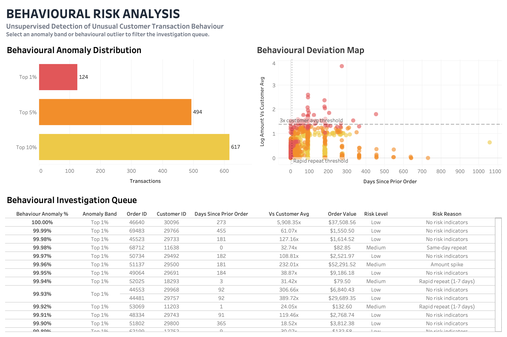
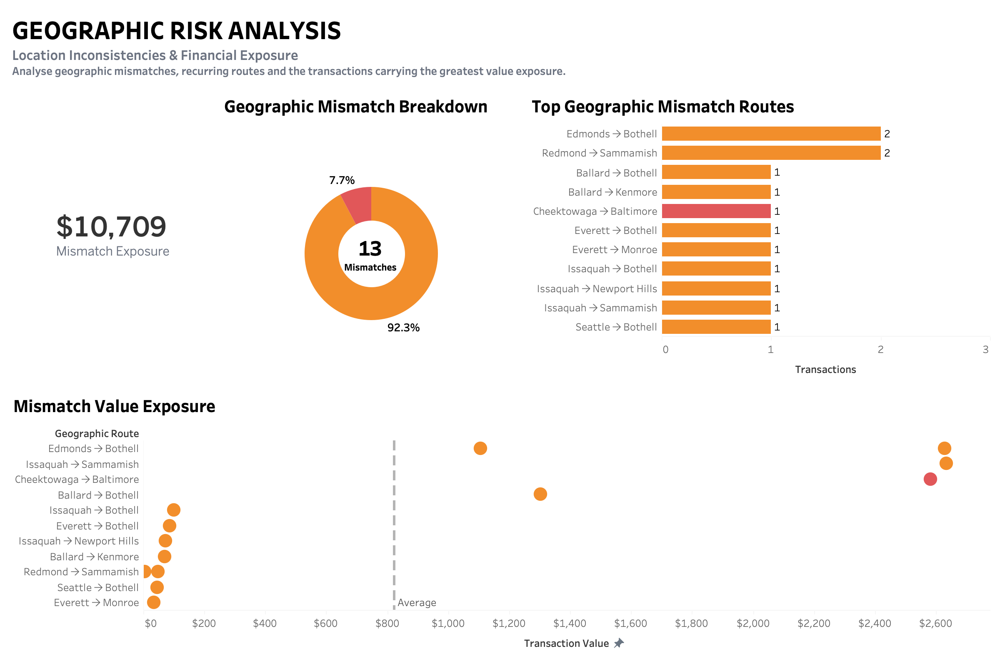
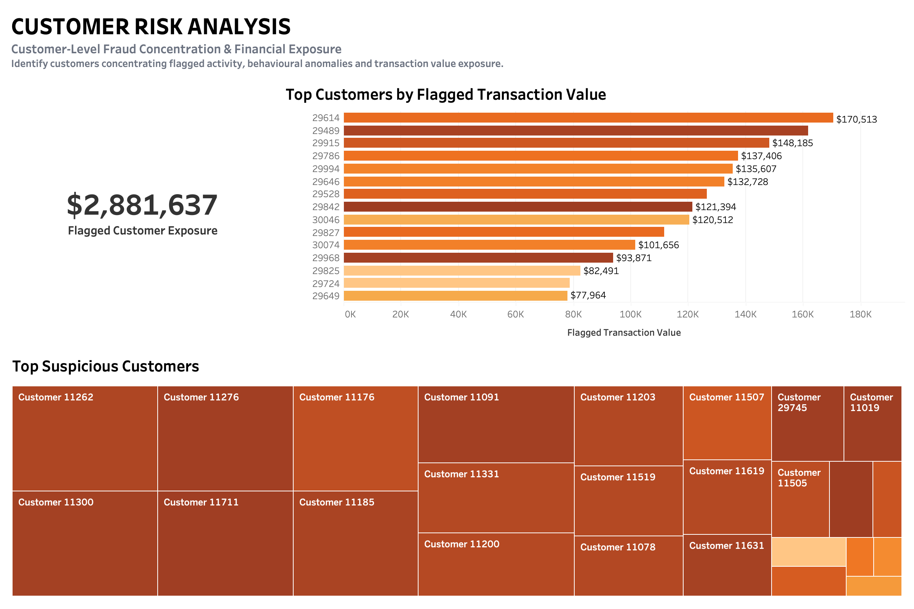

<h1 align="center">📊 Tableau Risk Analytics Dashboard</h1>

  <strong>Fraud Detection & Transaction Risk Monitoring</strong>

  A navigable Tableau dashboard suite designed to transform fraud detection outputs
  into an investigation-oriented Business Intelligence experience.

---

## 🧭 Dashboard Experience

The Tableau solution is structured around a central **Risk Analytics Hub**, providing direct access to five analytical modules.

Each dashboard includes **Previous** and **Next** navigation controls, creating a continuous analytical workflow from high-level risk monitoring to transaction- and customer-level investigation.

  <strong>
    Risk Analytics Hub → Risk Overview → Transaction Investigation → Behavioural Risk → Geographic Risk → Customer Risk
  </strong>

---

## 🖥️ Dashboard Gallery

Click any dashboard preview to view it in full size.

| | | |
|:---:|:---:|:---:|
|  |  |  |
| **Risk Analytics Hub** | **01 — Risk Overview** | **02 — Transaction Investigation** |
|  |  |  |
| **03 — Behavioural Risk** | **04 — Geographic Risk** | **05 — Customer Risk** |

---

## 01 — Risk Overview

High-level monitoring of transaction activity and overall risk exposure.

**Key areas:**

- Total transactions
- Flagged transactions
- High-risk transactions
- Model-eligible transactions
- Risk-level distribution
- Risk indicator trigger frequency
- Flagged transaction rate over time

---

## 02 — Transaction Investigation

Investigation-focused dashboard designed to identify and prioritise suspicious transactions for further review.

**Key areas:**

- Risk score distribution
- Top triggered risk reasons
- Investigation queue
- Transaction-level anomaly metrics
- Prior-order behaviour
- Customer and order identifiers
- Risk-based investigation prioritisation

---

## 03 — Behavioural Risk

Analysis of unusual customer and transaction behaviour to identify patterns that may indicate suspicious activity.

**Key areas:**

- Behavioural anomaly indicators
- Customer deviation analysis
- Repeat transaction behaviour
- Transaction velocity
- Behavioural investigation prioritisation

---

## 04 — Geographic Risk

Geographic analysis of transaction risk and inconsistencies between customer, billing and shipping information.

**Key areas:**

- Geographic risk indicators
- Shipping and billing mismatches
- City and state anomalies
- Geographic risk concentration
- Exposure by location

---

## 05 — Customer Risk

Customer-level analysis designed to identify accounts with elevated fraud and financial exposure.

**Key areas:**

- Customer risk exposure
- Flagged transaction value
- Suspicious customer ranking
- Customer-level anomaly indicators
- High-risk customer identification

---

## 📄 Full Dashboard Report

A complete PDF version of the dashboard suite is available below.

  <a href="BI-DASHBOARDS.pdf">
    <strong>📄 View Full Dashboard PDF</strong>
  </a>

---

## 🎯 Analytical Purpose

The dashboard layer converts the outputs of the fraud detection analysis into an investigation-oriented BI solution.

The analytical workflow is designed to help users:

1. Monitor overall transaction risk.
2. Identify abnormal patterns and risk indicators.
3. Prioritise flagged transactions for investigation.
4. Analyse behavioural and geographic anomalies.
5. Identify customers with elevated risk exposure.

This creates a structured journey from high-level monitoring to detailed transaction and customer investigation.

---

## 🛠️ Tools & Techniques

  <strong>Tableau · SQL · Python · EDA · Feature Engineering · Fraud Analytics · Risk Analytics</strong>

---

  <em>Part of the Fraud Detection & Risk Analytics portfolio project.</em>

